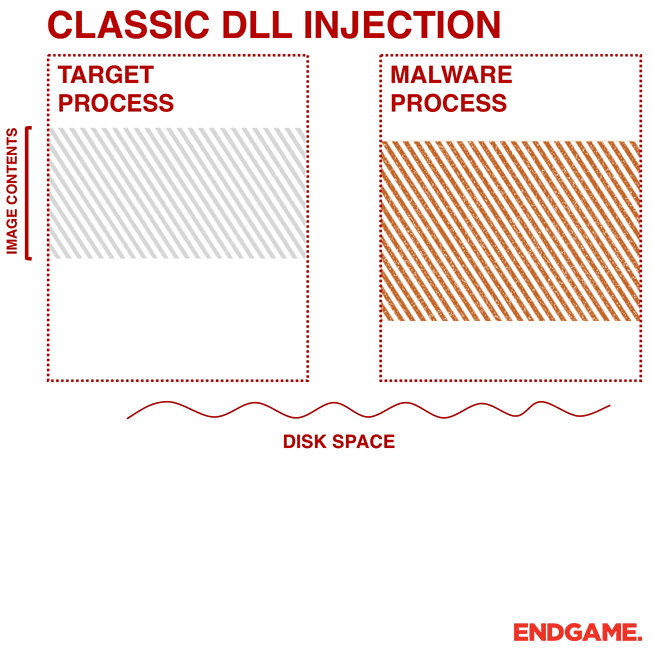

# Basic DLL Injection written in Rust  
  
Classic DLL injection via CreateRemoteThread & LoadLibrary.  
  

  
```rust 
cargo build --lib --release
cargo run --bin dllinjector --release
```
  
# Resources  
  
https://www.elastic.co/fr/blog/ten-process-injection-techniques-technical-survey-common-and-trending-process